<!DOCTYPE html>
<html lang="en">
<head>
  <meta charset="UTF-8">
  <meta name="viewport" content="width=device-width, initial-scale=1.0">
  <meta http-equiv="X-UA-Compatible" content="ie=edge">
  <link rel="stylesheet" href="css/events.css">
  <link rel="stylesheet" href="https://cdnjs.cloudflare.com/ajax/libs/animate.css/4.0.0/animate.min.css"/>
  <link rel="shortcut icon" href="source/1stPage/falconlogo.png" type="image/x-icon">
  
  <title>Events Falcon Project</title>
</head>
<body>
  

    

      

      

      

      

    

    <header class="header">
      

        <nav class="nav__menu">
          

            <ul class="nav__menu__list-item">
              <li>
                <a href="#" target="_blank" class="item__link">about</a>
                <a href="#" target="_blank" class="item__link">roadmap</a>
                <a href="#" target="_blank" class="item__link">whitepaper</a>
                <a href="#" target="_blank" class="item__link">team</a>
                <a href="#" target="_blank" class="item__link">events</a>
                <a href="#" target="_blank" class="item__link">swap</a>
                <a href="#" target="_blank" class="item__link">services</a>
              </li>
            </ul>
          

          

            <a href="https://t.me/Falcon_announcement">
              <svg width="22" height="23" viewBox="0 0 22 23" fill="none" xmlns="http://www.w3.org/2000/svg">
              <path id="link-1" fill-rule="evenodd" clip-rule="evenodd" d="M8.46429 19.7225V19.8279C8.46429 21.199 9.60714 22.324 11 22.324C12.3929 22.324 13.5357 21.199 13.5357 19.8279V19.7225H13.75H20C21.1071 19.7225 22 18.8436 22 17.7537C22 16.6639 21.1071 15.7498 20 15.7498H19.4643H19.4286H18.7857C18.6071 15.4686 18.5 15.117 18.5 14.7655V10.371C18.5 6.96087 16.1786 4.04293 12.8214 3.19919C12.7857 3.19919 12.7143 3.16403 12.7143 3.09372C12.6786 3.02341 12.6786 2.98825 12.7143 2.91794C12.8929 2.63669 13 2.28513 13 1.93357C13 0.843741 12.1071 0 11 0C9.89286 0 9.03572 0.843741 9.03572 1.93357C9.03572 2.28513 9.10714 2.63669 9.28572 2.91794C9.32143 2.98825 9.32143 3.02341 9.32143 3.09372C9.28572 3.16403 9.21429 3.19919 9.17857 3.19919C5.82143 4.04293 3.5 6.96087 3.5 10.371V14.7655C3.5 15.117 3.39286 15.4686 3.21429 15.7498H2.57143H2.03571C0.928571 15.7498 0 16.6639 0 17.7537C0 18.8436 0.928571 19.7225 2.03571 19.7225H8.28572H8.46429ZM12.0714 1.93357C12.0714 2.53122 11.6071 2.98825 11 2.98825C10.3929 2.98825 9.92857 2.53122 9.92857 1.93357C9.92857 1.33592 10.3929 0.878897 11 0.878897C11.6071 0.878897 12.0714 1.33592 12.0714 1.93357Z" fill="url(#paint0_linear)"/>
              <defs>
              <linearGradient id="paint0_linear" x1="-4.78733e-08" y1="17.7052" x2="21.6303" y2="17.1012" gradientUnits="userSpaceOnUse">
              <stop offset="1" stop-color="#FF00A8"/>
              <stop offset="1" stop-color="#FF003D"/>
              </linearGradient>
              </defs>
              </svg>
            </a>
            <a href="https://twitter.com/Falcon_SBS">
              <svg width="25" height="20" viewBox="0 0 25 20" fill="none" xmlns="http://www.w3.org/2000/svg">
              <path id="link-2" fill-rule="evenodd" clip-rule="evenodd" d="M12.3039 6.21687C8.03922 5.9759 4.26471 4 1.71569 0.915663C1.27451 1.68675 1.02941 2.55422 1.02941 3.46988C1.02941 5.20482 1.96078 6.74699 3.33333 7.66265C2.5 7.66265 1.66667 7.42169 0.980392 7.03614V7.08434C0.980392 9.54217 2.7451 11.5663 5.09804 12.0482C4.65686 12.1446 4.21569 12.241 3.77451 12.241C3.43137 12.241 3.08824 12.1928 2.79412 12.1446C3.43137 14.1205 5.34314 15.6145 7.59804 15.6145C5.83333 17.012 3.62745 17.7831 1.22549 17.7831C0.784314 17.7831 0.392157 17.7831 0 17.7349C2.2549 19.1807 4.95098 20 7.84314 20C17.3039 20 22.451 12.2892 22.451 5.63855V4.96386C23.4314 4.28916 24.3137 3.37349 25 2.36145C24.0686 2.74699 23.0882 3.03614 22.0588 3.18072C23.1373 2.55422 23.9216 1.54217 24.3137 0.385542C23.3333 0.963855 22.2059 1.3494 21.0784 1.59036C20.1471 0.626506 18.7745 0 17.3039 0C14.4608 0 12.1569 2.26506 12.1569 5.06024C12.1569 5.44578 12.2059 5.83133 12.3039 6.21687Z" fill="url(#paint0_linear)"/>
              <defs>
              <linearGradient id="paint0_linear1" x1="-5.44015e-08" y1="15.8621" x2="24.5683" y2="14.9919" gradientUnits="userSpaceOnUse">
              <stop offset="1" stop-color="#FF00A8"/>
              <stop offset="1" stop-color="#FF003D"/>
              </linearGradient>
              </defs>
              </svg>
            </a>
            <a href="https://t.me/Falcon_official">
              <svg width="24" height="20" viewBox="0 0 24 20" fill="none" xmlns="http://www.w3.org/2000/svg">
              <path id="link-3" fill-rule="evenodd" clip-rule="evenodd" d="M19.2031 4.41023L9.28466 13.2206L9.05612 14.4343L8.82759 16.8616L6.9079 11.4225L18.746 4.00567C18.746 4.00567 19.4773 3.55616 19.4773 4.00567C19.4773 4.00567 19.6144 4.05062 19.2031 4.41023ZM21.8084 0.229806L0.874572 8.276C0.874572 8.276 -0.0852757 8.6356 0.00613834 9.21996C0.0518453 9.84927 0.874572 10.119 0.874572 10.119L5.6281 11.6923L8.59905 19.4687C8.8733 19.6036 9.14754 19.3788 9.14754 19.3788L12.667 15.9626L17.8319 19.8283C19.2945 20.4577 19.7973 19.1541 19.7973 19.1541L23.5452 0.724264C23.5452 -0.534358 21.8084 0.229806 21.8084 0.229806Z" fill="url(#paint0_linear)"/>
              <defs>
              <linearGradient id="paint0_linear2" x1="-7.25744e-08" y1="15.8621" x2="23.1419" y2="15.0901" gradientUnits="userSpaceOnUse">
              <stop offset="1" stop-color="#FF00A8"/>
              <stop offset="1" stop-color="#FF003D"/>
              </linearGradient>
              </defs>
              </svg>
            </a>
          

        </nav>
      

      

        
        
        
      

      

        
        
        
      

      

    </header>
    <article class="article">
      

        

          

            <figure class="main__events__vouchers-swap block__image">
              

                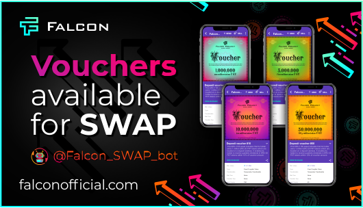
              

              <figcaption class="block__image__description">
                  
                  Our @Falcon_swap_bot is fully tested and Proof of Hold [PoH] system has already launched a timer for the first lucky ones, who have already received their vouchers!
                  
                  
                    Swap tokens for vouchers are officially open! Act until they all run out!
                  
              </figcaption>
            </figure>
          

          

            <figure class="main__events__airdrop-completed block__image">
              

                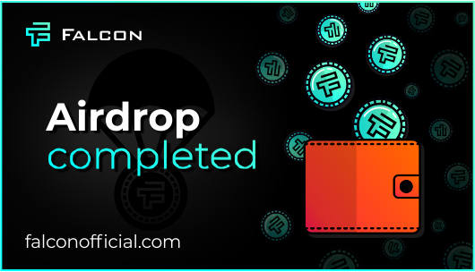
              

              <figcaption class="block__image__description">
                  
                  It is done! All FNT tokens on your wallets, dear holders of the Falcon STAGE collection!
                  
                  
                    Airdrop is over!
                  
                  
                    But we are just began our glorious journey! Watch the news carefully!
                  
                  
                    And take care of your STAGE cards, they will come in handy more than once!
                  
              </figcaption>
            </figure>
          

          

            <figure class="main__events__airdrop block__image">
              

                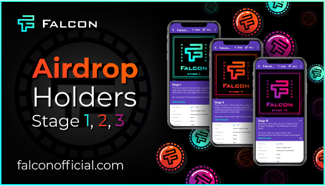
              

              <figcaption class="block__image__description">
                  
                  Well, it's time for the long-awaited news!
                  
                  
                    Falcon Project FNT Token Airdrop Conditions. Please, <a class="link" href="https://telegra.ph/FALCON-project--CHto-takoe-Proof-of-Hold-05-03">read</a> very carefully!
                  
                  
                    ad carefully while holding STAGE cards to your chest!
                  
              </figcaption>
            </figure>
          

          

            <figure class="main__events__poh block__image">
              

                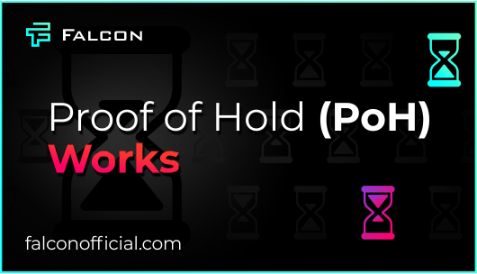
              

              <figcaption class="block__image__description">
                  
                  Falcon Project is ahead of schedule!
                  
                  
                    Proof of Hold PoH technology has been launched and is waiting for your vouchers to launch a hold counter! 😎
                  
                  
                    You can learn more about Proof of Hold technology in <a class="link" href="https://telegra.ph/FALCON-project--CHto-takoe-Proof-of-Hold-05-03">this short explanation</a>
                  
              </figcaption>
            </figure>
          

          

            <figure class="main__events__partnership block__image">
              

                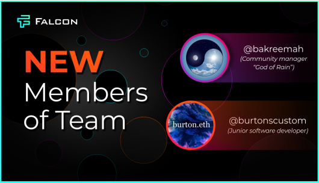
              

              <figcaption class="block__image__description">
                  
                  We are pleased to inform you that the Falcon Project team we took two wonderful guys into the family! 😌
                  
                  
                    Abubakr <a class="hashtag" href="@bakreemah">@bakreemah</a> - a great community manager, also known as the God of Rain! 🌧🌈
                  
                  
                    Michael Barton <a class="hashtag" href="@bakreemah">@burtonscustom</a> - junior software developer and father first in the world Proof of Hold bot.
                  
                  Greet these glorious guys who help bring the Falcon Project to life! 👏😎
              </figcaption>
            </figure>
          

          

            <figure class="main__events__partnership block__image">
              

                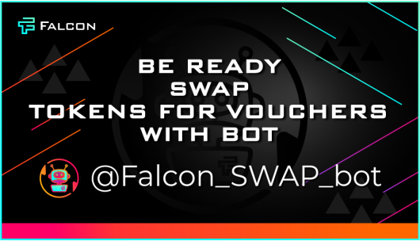
              

              <figcaption class="block__image__description">
                Another milestone achieved
                
                  Falcon swap bot already knows how to accept your applications for swap tokens for vouchers!
                
                <a class="hashtag" href="@Falcon_swap_bot">@Falcon_swap_bot</a>
                
                  Falcon swap bot already knows how to accept your applications for swap tokens for vouchers!
                
                But do not rush to wake him, not yet time! We activate it after a massive airdrop!
              </figcaption>
            </figure>
          

          

            <figure class="main__events__partn-study block__image">
              

                
              

              <figcaption class="block__image__description">
                Friends! We present to your attention the next FNT integration!
                
                

                  
                    This time it will be a quest game about developing a new multimedia application that will help to master product management.
                  
                  
                    This game is at the very beginning of its development, but already now we can say that you can pay for the finished course using FNT tokens and most interestingly, you can get real tokens in the process of passing the game and withdraw them at its completion!
                  
                  Be sure to check out their <a href="http://StudyQuest.online">official website</a>
                

                <button class="button-partner-study" type="button">learn more</button>
              </figcaption>
            </figure>
          

          

            <figure class="main__events__tipbot block__image">
              

                
              

              <figcaption class="block__image__description">
                Now the FNT token is officially added to the VeriSafe
                @TipGramBot
                
                  With it, you can receive and send donations in Falcon tokens via telegram chats! FNT is getting closer! Mass adoption is coming
                
                <a class="hashtag" href="@Falcon_swap_bot">@Falcon_swap_bot</a>
                Check <a class="link" href="https://t.me/VeriSafeNews/234">this</a>
                
              </figcaption>
            </figure>
          

          

            <figure class="main__events__vouchers block__image">
              

                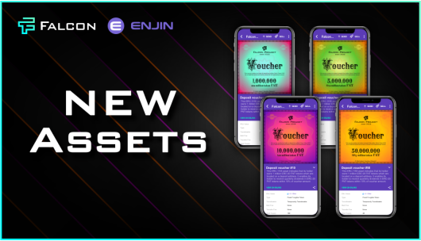
              

              <figcaption class="block__image__description">
                At that moment, while the earth rushes into absolute obscurity in the vast expanse of space, the Falcon Project team realized its unique system of dividend vouchers on the blockchain!
                <a class="link" href="https://enjinx.io/eth/platform/3434/assets">Check how beautiful they are</a>
                
                  The holder of such a voucher is guaranteed dividend payments of 40% per year. And this is nothing more than a Proof of Hold!
                
                And yes, that's what we called this system! [PoH] Interesting?
                More details in the article on vouchers, which will be published in the coming days!
              </figcaption>
            </figure>
          

          

            <figure class="main__events__enjin-forum block__image">
              

                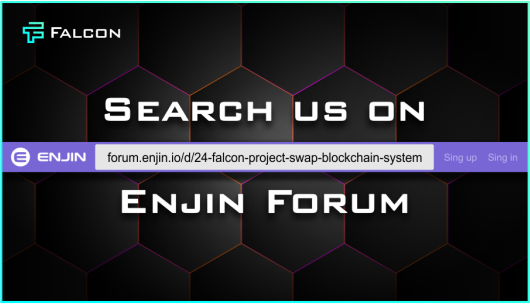
              

              <figcaption class="block__image__description">
                There is no limit to perfection, just as there is no limit to social networks for communication!
                <a class="link" href="https://enjinx.io/eth/platform/3434/assets">Check how beautiful they are</a>
                Now we have our own thread on the Enjin Developer & Community Forum!
                <a class="link" href="https://forum.enjin.io/d/24-falcon-project-swap-blockchain-system">Meet and join</a>
              </figcaption>
            </figure>
          

          

            <figure class="main__events__congratulations block__image">
              

                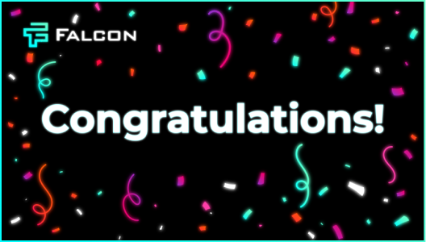
              

              <figcaption class="block__image__description">
                Hello strong guys!
                <a class="link" href="https://enjinx.io/eth/platform/3434/assets">Check how beautiful they are</a>
                After a long discussion, we are finally ready to name our glorious winners of the art competition
                

                  <ul>
                    <li class="description__header">Nominations and prizes:</li>
                    <li>
                      <ol>
                        <li class="nominations__title">Video clip on the Falcon Project</li>
                        <li class="hashtag">#video</li>
                        <li class="contest__results"><a class="link" href="https://t.me/Falcon_official/1112">1st place - 7 million FNT</a></li>
                        <li class="contest__results"><a class="link" href="https://t.me/Falcon_official/1012">2nd place - 5 million FNT</a></li>
                        <li class="contest__results"><a class="link" href="https://t.me/Falcon_official/979">3rd place - 3 million FNT</a></li>
                      </ol>
                    </li>
                    <li>
                      <ol>
                        <li class="nominations__title">Gif animation on the theme of the Falcon Project</li>
                        <li class="hashtag">#gif</li>
                        <li class="contest__results"><a class="link" href="https://t.me/Falcon_official/892">1st place - 1 million FNT</a></li>
                        <li class="contest__results"><a class="link" href="https://t.me/Falcon_official/914">2nd place - 800 thousand FNT</a></li>
                        <li class="contest__results"><a class="link" href="https://t.me/Falcon_official/1091">3rd place - 600 thousand FNT</a></li>
                        <li class="contest__results"><a class="link" href="https://t.me/Falcon_official/999">4th place - 400 thousand FNT</a></li>
                        <li class="contest__results"><a class="link" href="https://t.me/Falcon_official/992">5th place - 200 thousand FNT</a></li>
                      </ol>
                    </li>
                    <li>
                      <ol>
                        <li class="nominations__title">Creative promotional image for Twitter</li>
                        <li class="hashtag">#image</li>
                        <li class="contest__results"><a class="link" href="https://t.me/Falcon_official/885">1st place - 1 million FNT</a></li>
                        <li class="contest__results"><a class="link" href="https://t.me/Falcon_official/1059">2nd place - 500 thousand FNT</a></li>
                        <li class="contest__results"><a class="link" href="https://t.me/Falcon_official/1110">3rd place - 250 thousand FNT</a></li>
                        <li class="contest__results"><a class="link" href="https://t.me/Falcon_official/1047">4th place - 250 thousand FNT</a></li>
                        <li class="contest__results"><a class="link" href="https://t.me/Falcon_official/901">5th place - 250 thousand FNT</a></li>
                      </ol>
                    </li>
                    <li>
                      <ol>
                        <li class="nominations__title">The best Falcon chat stickers. Evaluation of three stickers at once: greeting, approval, rejoicing</li>
                        <li class="hashtag">#sticker</li>
                        <li class="contest__results"><a class="link" href="https://t.me/addstickers/FalconSticker">1st place - 1.5 million FNT</a></li>
                        <li class="contest__results"><a class="link" href="https://t.me/addstickers/FalconProject">2nd place - 1 million FNT</a></li>
                        <li class="contest__results"><a class="link" href="https://t.me/addstickers/FalconProject">3rd place - 700 thousand FNT</a></li>
                      </ol>
                    </li>
                    <li>
                      <ol>
                        <li class="nominations__title">Category HUMOR. Image, video, motivator and other visual work.</li>
                        <li class="hashtag">#haha</li>
                        <li class="contest__results"><a class="link" href="https://t.me/Falcon_official/908">1st place - 1 million FNT</a></li>
                        <li class="contest__results"><a class="link" href="https://t.me/Falcon_official/1049">2nd place - 550 thousand FNT</a></li>
                        <li class="contest__results"><a class="link" href="https://t.me/Falcon_official/1104">3rd place - 550 thousand FNT</a></li>
                        <li class="contest__results"><a class="link" href="https://t.me/Falcon_official/1040">4th place - 550 thousand FNT</a></li>
                        <li class="contest__results"><a class="link" href="https://t.me/Falcon_official/957">5th place - 550 thousand FNT</a></li>
                      </ol>
                    </li>
                    <li>
                      <ol>
                        <li class="nominations__title">After viewing all the works, the administration decided to award two more participants with incentive prizes of 500 thousand FNT:</li>
                        <li class="contest__results">1) For real video shooting and props - 500 thousand FNT 
                        
@odesskot2

                        </li>
                        <li class="contest__results">For the will to win and participation in various nominations - 500 thousand FNT - <a class="hashtag" href="#">@DimaM1993</a> Congratulations to all the winners and thank all the participants for their excellent work! 🥳 We will definitely be holding similar contests again! 👏 __ 📢 To receive reward, need to send your Ethereum address in direct messages<a class="hashtag" href="#">@Lav_rus</a>
                        </li>
                      </ol>
                    </li>
                  </ul>
                

                <button class="button" type="button">learn more</button>
              </figcaption>
            </figure>
          

          

            <figure class="main__events__partnership block__image">
              

                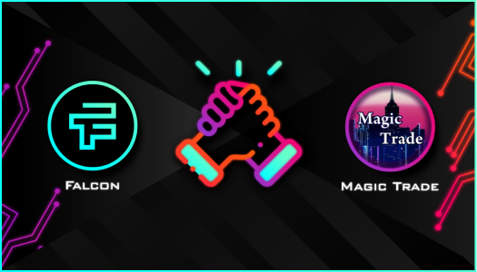
              

              <figcaption class="block__image__description">
                The Falcon Project is still in the process of birth, but the "Magic Trade" group is ready to accept payment for its services with Falcon tokens! Small step to great adoption!
                
                  Small step to great adoption!
                
              </figcaption>
            </figure>
          

          

            <figure class="main__events__art block__image">
              

                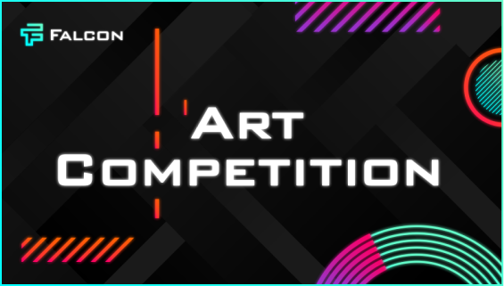
              

              <figcaption class="block__image__description">
                Attention! Falcon Project announces a massive creative art competition with a prize pool of 25,000,000 FNT! Everyone can take part!
                

                  <ul>
                    <li class="description__header">Nominations and prizes:</li>
                    <li>
                      <ol>
                        <li class="nominations__title">Video clip on the Falcon Project</li>
                        <li class="hashtag">#video</li>
                        <li class="contest__results">1st place - 7 million FNT</li>
                        <li class="contest__results">2nd place - 5 million FNT</li>
                        <li class="contest__results">3rd place - 3 million FNT</li>
                      </ol>
                    </li>
                    <li>
                      <ol>
                        <li class="nominations__title">Gif animation on the theme of the Falcon Project</li>
                        <li class="hashtag">#gif</li>
                        <li class="contest__results">1st place - 1 million FNT</li>
                        <li class="contest__results">2nd place - 800 thousand FNT</li>
                        <li class="contest__results">3rd place - 600 thousand FNT</li>
                        <li class="contest__results">4th place - 400 thousand FNT</li>
                        <li class="contest__results">5th place - 200 thousand FNT</li>
                      </ol>
                    </li>
                    <li>
                      <ol>
                        <li class="nominations__title">Creative promotional image for Twitter</li>
                        <li class="hashtag">#image</li>
                        <li class="contest__results">1st place - 1 million FNT</li>
                        <li class="contest__results">2nd place - 500 thousand FNT</li>
                        <li class="contest__results">3-5 place - 250 thousand FNT</li>
                      </ol>
                    </li>
                    <li>
                      <ol>
                        <li class="nominations__title">The best Falcon chat stickers. Evaluation of three stickers at once: greeting, approval, rejoicing</li>
                        <li class="hashtag">#sticker</li>
                        <li class="contest__results">1st place - 1.5 million FNT</li>
                        <li class="contest__results">2nd place - 1 million FNT</li>
                        <li class="contest__results">3rd place - 700 thousand FNT</li>
                      </ol>
                    </li>
                    <li>
                      <ol>
                        <li class="nominations__title">Category HUMOR. Image, video, motivator and other visual work.</li>
                        <li class="hashtag">#haha</li>
                        <li class="contest__results">1st place - 1 million FNT</li>
                        <li class="contest__results">2nd place - 550 thousand FNT</li>
                        <li class="contest__results">3-5 place - 550 thousand FNT</li>
                      </ol>
                    </li>
                    <li>
                      <ol>

                      </ol>
                    </li>
                  </ul>
                

                <button class="button-three" type="button">learn more</button>
              </figcaption>
            </figure>
          

        

      

    </article>
    <footer class="footer">
      

        

          

            
          

          

            
          

          

            
          

          

            
          

          

            
          

        

        

          <a href="#top">
          

            
          

          

            <h5>© Falcon Project, 2020</h5>
          

          </a>
        

      

    </footer>
  

</body>
</html>
